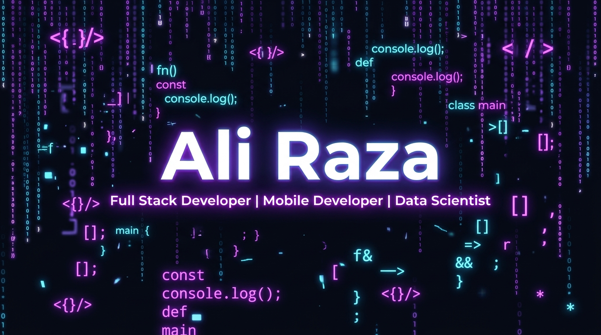

<!-- BANNER -->
<div align="center">
  
</div>

<br/>

<!-- ANIMATED TYPING -->
<div align="center">
  

  
</div>

---

<!-- ABOUT ME -->
## 🙋‍♂️ About Me


### 👨‍💻 Ali Raza | Passionate Full Stack Developer from Pakistan 🇵🇰

- 🎓 **Computer Science Student** passionate about building real-world solutions
- 🌍 Based in **Pakistan 🇵🇰**
- 💡 Open Source Enthusiast | Problem Solver | Coffee Addict ☕
- 🚀 I love building **scalable web apps**, **mobile apps**, and **AI-powered solutions**
- 🧠 Passionate about writing **clean, efficient code** and solving real-world problems
- ⚡ Full Stack & Mobile dev who loves turning **complex problems into elegant solutions**
- 🌱 Currently exploring **AI/ML**, **Cloud-native** architectures & **LLM fine-tuning**
- 💬 Ask me about **React, Flutter, Python, Django, FastAPI** or anything tech!
- 🎯 **2024 Goal:** Contribute more to open source & build impactful products

<br clear="right"/>

---

<!-- ABOUT ME CODE BLOCK -->
```typescript
const AliRaza = {
  name:     "Ali Raza",
  location: "Pakistan 🇵🇰",
  role:     ["Full Stack Developer", "Mobile Developer", "Data Scientist"],
  education: "Computer Science Student 🎓",
  languages: ["Python", "JavaScript", "TypeScript", "Java", "C++", "C#", "Dart", "Kotlin", "Swift", "Go"],
  frameworks: ["React", "Next.js", "Vue.js", "Flutter", "Node.js", "Django", "FastAPI", "Spring Boot"],
  cloud:     ["AWS", "Azure", "GCP", "Docker", "Kubernetes"],
  ai_ml:     ["TensorFlow", "PyTorch"],
  hobbies:   ["Coding 💻", "Gaming 🎮", "Problem Solving 🧩", "Coffee ☕"],
  motto:     "Code. Build. Ship. Repeat. 🚀",
};
```

---

## 🛠️ Tech Stack & Tools

### 👨‍💻 Languages
<p align="left">
  
  
  
  
  
  
  
  
  
  
</p>

### 🚀 Frameworks & Libraries
<p align="left">
  
  
  
  
  
  
  
  
  
  
</p>

### ☁️ Cloud & DevOps
<p align="left">
  
  
  
  
  
</p>

---

## 📊 GitHub Stats

<div align="center">
  
  
</div>

<div align="center">
  
</div>

---

## 📈 Contribution Graph

<div align="center">
  
</div>

---

## 🌱 Currently Learning

- 🤖 Advanced AI/ML models & LLM fine-tuning
- ☁️ Cloud-native architecture & microservices
- 📱 Cross-platform app development with Flutter
- 🔐 Cybersecurity & secure coding practices

---

## ⚡ Fun Facts

- 💡 I turn coffee ☕ into code
- 🌙 Night owl coder — best ideas come after midnight
- 🎮 Gamer when I am not coding
- 🧩 I love solving complex algorithms just for fun
- 🤝 Always happy to collaborate on cool open-source projects!

---

<div align="center">

  ### 🏆 GitHub Trophies
  

  ---

  

  ⭐️ **From [AliRaza30](https://github.com/AliRaza30) with ❤️**

</div>
